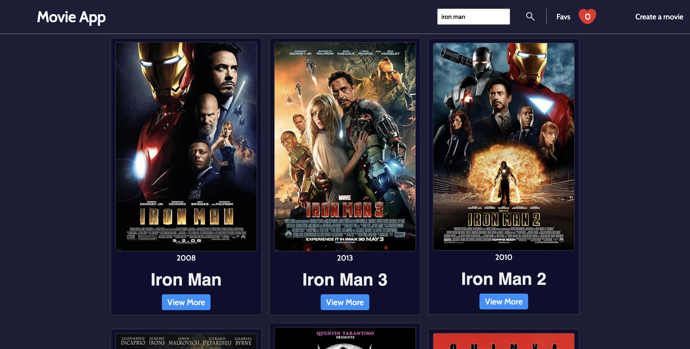

# Movie Finder 🎥✨  

A web app built with HTML, CSS, and JavaScript that allows users to search for movies, add them to their favorites, and even create custom movies!  

## Features ✨  
- **Search Movies**: Find movies by name using a public API.  
- **Add to Favorites**: Save your favorite movies for quick access later.  
- **Remove from Favorites**: Manage your favorites list with ease.  
- **Create Custom Movies**: Add your own movies, and they’ll appear in search results.  

## How It Works ⚙️  
1. Search for a movie by typing its name in the search bar.  
2. View the search results fetched from the movie API.  
3. Add a movie to your favorites list by clicking the "Add to Favorites" button.  
4. Remove movies from your favorites list anytime.  
5. Create a custom movie by entering its details (e.g., title, description, and image) and add it to the database.  

## Tech Stack 🛠️  
- **HTML**: Structure of the app.  
- **CSS**: Styled with custom CSS for a clean and modern design.  
- **JavaScript**: Handles API calls, user interactions, and dynamic content updates.  
- **API**: Fetch movie data from a public movie API .

## Demo 🚀  

